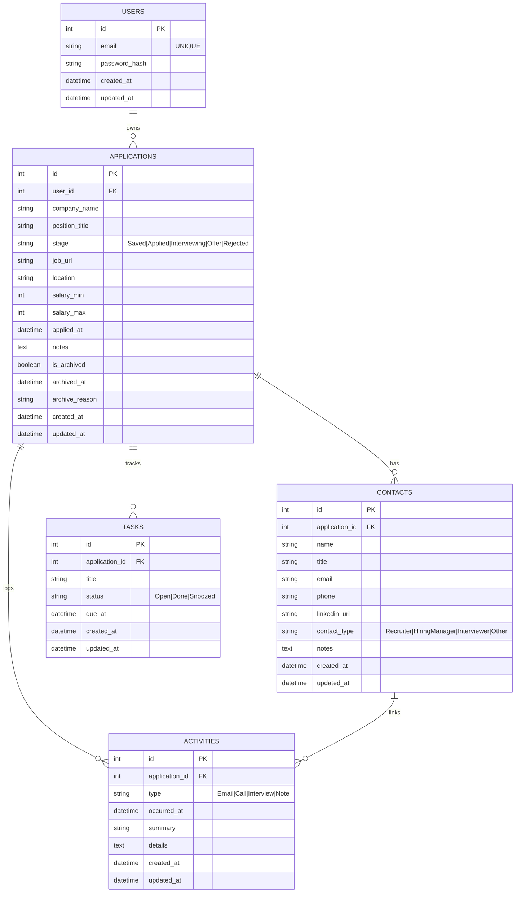

# Database Design (Logical Model)

This document defines the logical data model for the Job Application Tracker capstone.
Target DB: **MySQL** (implemented via Sequelize models + migrations).
Ownership rule: All records are private to the logged-in user. A user can only access records linked to their own `user_id` via the `applications` table.

---

## Entities

### users

Represents an account that owns data in the system.

**Key fields**

- id (PK)
- email (unique)
- password_hash
- first_name, last_name
- created_at, updated_at

**Notes**

- Each user owns their own set of applications.
- All other records are scoped to the user through application ownership.

---

### applications

Central record in the system. Each application represents a single role a user is pursuing.
In the UI, applications are labeled as: **`company_name — position_title`**.

**Key fields**

- `id` (PK)
- `user_id` (FK → `users.id`)
- `company_name` (string; user-entered)
- `position_title` (string; user-entered)
- `stage` (enum: Saved | Applied | Interviewing | Offer | Rejected)
- `job_url` (optional)
- `location` (optional)
- `salary_min`, `salary_max` (optional)
- `applied_at` (optional datetime)
- `notes` (optional text)
- `is_archived` (boolean)
- `archived_at` (optional datetime)
- `archive_reason` (optional string)
- `created_at`, `updated_at`

**Notes**

- “Company” is not a separate table in MVP; it is stored on the application record.
- Multiple applications may share the same `company_name` (e.g., applying to different roles at the same company).
- Applications can be archived rather than permanently deleted from the main workflow.

---

### activities

Logged interactions related to an application (emails, calls, interviews, notes).

**Key fields**

- `id` (PK)
- `application_id` (FK → `applications.id`)
- `contact_id` (optional FK → `contacts.id`)
- `type` (enum: Email | Call | Interview | Note)
- `occurred_at` (datetime)
- `summary` (short text)
- `details` (optional long text)
- `created_at`, `updated_at`

**Notes**

- Every activity belongs to an application.
- An activity can also optionally be linked to a contact.

---

### tasks

Follow-ups or reminders related to an application.

**Key fields**

- `id` (PK)
- `application_id` (FK → `applications.id`)
- `title`
- `due_at` (optional datetime)
- `status` (enum: Open | Done | Snoozed)
- `created_at`, `updated_at`

**Notes**

- Tasks belong directly to an application.
- Tasks are currently managed in a board-style interface grouped by due-date status.

---

### contacts

People associated with a company (recruiters, hiring managers, etc).

**Key fields**

- `id` (PK)
- application_id (FK)
- `name`
- `title` (optional)
- `email` (optional)
- `phone` (optional)
- `linkedin_url` (optional)
- `contact_type` (enum: Recruiter | HiringManager | Interviewer | Other)
- `notes` (optional)
- `created_at`, `updated_at`

**Notes**

- Contacts belong directly to an application in the MVP.

---

## Relationships

### MVP relationships (build first)

- **Users 1 → M Applications**
- **Applications 1 → M Activities**
- **Applications 1 → M Tasks**
- **Applications 1 → M Contacts**
- **Contacts 1 → M Activities** _(optional relationship through `activities.contact_id`)_

---

## Delete Behavior (Recommended)

- Deleting a **User** deletes their **Applications** and all dependent records.
- Deleting an **Application** deletes its **Contacts**, **Activities**, and **Tasks**.
- Deleting a **Contact** should set related `activities.contact_id` to `NULL` rather than deleting the activities themselves, because the activity may still be valuable as part of the application history.

---

## Data Access Rule (API Enforcement)

All reads and writes must be scoped to the logged-in user by enforcing ownership through the application record:

- `applications.user_id = req.user.id`

This means:

- applications are queried directly by `user_id`
- contacts, activities, and tasks are only accessible if their related application belongs to the logged-in user
- activities linked to contacts must still belong to an application owned by that user

---

### Defaults (implemented in migrations)

- `applications.stage` default = `Saved`
- `applications.is_archived` default = `false`
- `tasks.status` default = `Open`
- `contacts.contact_type` default = `Other`

### Enum sets (implemented as MySQL ENUM or Sequelize validation)

- `applications.stage`: `Saved`, `Applied`, `Interviewing`, `Offer`, `Rejected`
- `tasks.status`: `Open`, `Done`, `Snoozed`
- `activities.type`: `Email`, `Call`, `Interview`, `Note`
- `contacts.contact_type`: `Recruiter`, `HiringManager`, `Interviewer`, `Other`

---

## Mermaid ER Diagram

