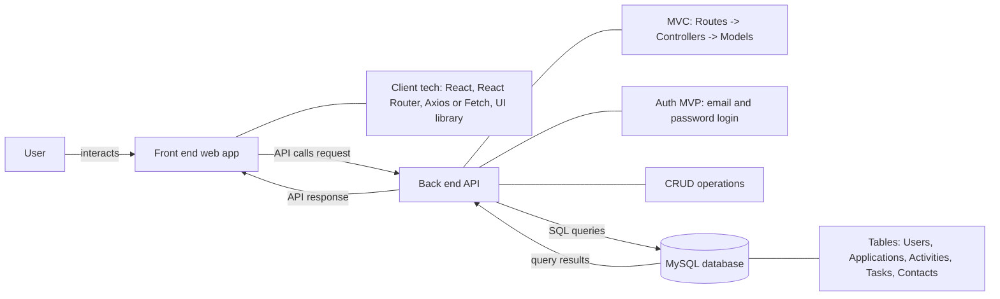
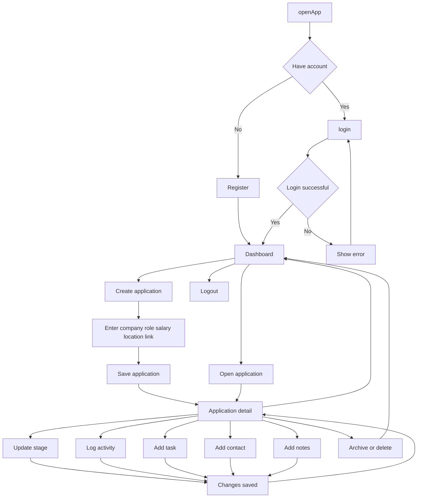

# Capstone Project Document Template

> [!NOTE]
> The following are the candidate sections of the document. They are presented here for guidance. Questions in each section could be used as possible aspects to cover. Some questions may not be applied to each project. On the other hand, additional information may be needed.

## Introduction

### Purpose

**What is the problem or the opportunity that the project is investigating?**

Job searching lacks a centralized place to organize everything like job listings, application statuses, interview notes, followups, emails. This project provides a system to organize the information and also provide visibility through the job application lifecycle.

**Why is this problem valuable to address?**

A disorganized job search can lead to missed follow-ups, duplicated applications, mistracked interview stages, and reduced hiring/offer rates. In this job market, better organization can streamline the process and directly impact employment outcomes.

**What is the current state (e.g. unsatisfied users, lost revenue)?**

Many users like myself rely on manually tracking through tools like spreadsheets, notes apps, or sheer memory to track applications. While platforms like LinkedIn and Indeed provide job listings they lack hiring pipeline tools beyond just what was saved or applied.

**What is the desired state?**

A centralized dashboard where users can:

- manage applications(company, role, salary range, location, link),
- track progress through defined stages (Saved, Applied, Interviewing, Offer, Rejected),
- log interview activities(calls, emails, interviews),
- store contacts per company (recruiter, hiring manager),
- add tasks/reminders (follow up next Monday)
- store notes and useful links related to each opportunity

**Has this problem been addressed by other projects? What were the outcomes?**

From what I have researched, platforms like Hunter and other tools have similar pipeline style tracking systems but are subscription-based, have limited customization, or don't integrate enough relational data modeling, resulting in going off app…users often resort to using spreadsheets, notes apps, or disconnected tools

### Industry/ Domain

**What is the industry/ domain?**

The project falls within the Job Search Technology and Career Management Software domain, which is part of the broader HR Technology (HRTech) industry.

**What is the current state of this industry? (e.g. challenges from startups)**

The industry is highly competitive and dominated by large platforms such as LinkedIn and Indeed for job discovery. Smaller tools and startups in this space tend to focus on organization, automation, analytics, and applicant-side workflow support rather than job listings alone.

**What is the overall industry value-chain?**

The value chain typically includes:

- Employers creating job listings
- Platforms distributing job postings
- Candidates discovering and applying to jobs
- Recruiters reviewing and interviewing candidates
- Hiring decisions and onboarding

This project operates within the candidate management stage of the value chain, focusing on applicant-side organization rather than employer-side recruitment systems.

**What are the key concepts in the industry?**

- Applicant tracking
- Hiring pipeline stages
- Workflow management
- User authentication and security
- Data organization and analytics
- Productivity and career management

**Is the project relevant to other industries?**

Yes. The core architecture of this system could be adapted to other pipeline-based workflows such as sales tracking/CRM systems, project management tools, freelance client tracking, or college admissions tracking systems. The underlying design pattern is applicable to any structured multi-stage process.

### Stakeholders

**Who are the stakeholders? (be as specific as possible as to who would have access to the software)**

Primary Users: Job seekers managing their application pipeline
Secondary Users (future scope): Career coaches or mentors who may assist applicants
Developers/Maintainers: Individuals responsible for maintaining and scaling the system

**Why do they care about this software?**

Primary stakeholders (job seekers) care because the job search process is often stressful, fragmented, and difficult to manage. This software provides structure, visibility, and control over their application pipeline, helping them avoid missed follow-ups, duplicate applications, and lost opportunities. By centralizing job data in one system, users can make more informed decisions and track measurable progress toward employment.

Secondary stakeholders, such as career coaches or mentors, care because the system provides transparent insight into a candidate’s progress. It allows them to identify bottlenecks in the hiring process and offer targeted guidance.

From a technical perspective, developers and maintainers care because the system demonstrates scalable architecture, secure authentication, structured data modeling, and maintainable code practices. These qualities ensure the software is reliable, extensible, and adaptable to future enhancements.

**What are the stakeholders’ expectations?**

- Secure authentication and data privacy
- Reliable CRUD functionality
- Clear dashboard visualization of application stages
- Accurate data persistence
- Responsive and intuitive UI
- Stable performance and test coverage

## Product Description

### Architecture Diagram

Job Application Tracker is a client-server web application designed to help users manage the full lifecycle of their job search in one centralized system. The application allows authenticated users to create and manage job applications, track progress through hiring stages, store related contacts, log activities such as calls or interviews, and manage follow-up tasks.

The system uses a React-based front end and a Node/Express back end connected to a MySQL database. The backend follows an MVC structure, with routes handling endpoint definitions, controllers managing business logic, and Sequelize models interacting with the database. Authentication is implemented using email/password login with JWT-based protected routes. Each request to protected resources is scoped to the authenticated user so that users can only access their own records.

The application is centered around the **application** record, which acts as the parent entity for related contacts, activities, and tasks. This design supports a structured and connected workflow while keeping the MVP data model manageable.

#### Client (Front-End)

- **React** – UI rendering and component-based pages (Login, Dashboard, Forms)
- **React Router** – navigation between pages (protected pages for logged-in users)
- **Fetch API** – API client for sending requests to the server
- **Material UI (MUI)** – provides form controls, layout components, cards, dialogs, and responsive styling

#### Server (Back-End)

- **Node.js** – JavaScript runtime for the server
- **Express.js** – REST API framework and routing
- **MVC Structure**
  - **Routes** – map API endpoints (e.g., `/api/applications`)
  - **Controllers** – handle request logic, validation, and business rules
  - **Models** – interact with the database (SQL queries / ORM)
- **Authentication (MVP)**
  - `POST /api/auth/register` – creates a user
  - `POST /api/auth/login` – verifies email and password, returns user information (e.g., `userId`)
  - Subsequent requests include `userId` to scope data to the logged-in user

#### Database (see database.md)

- **MySQL** – relational storage for:
  - Users
  - Applications
  - Activities (interviews / notes)
  - Tasks (follow-ups)
  - Contacts

---

### User Stories

#### 1. Account Registration

**Priority:** High

**Description:**
User is able to create an account using email and password.

**User Story:**
As a user, I want to create an account with my email and password
so that I can securely access and manage my job applications.

**Acceptance Criteria:**

- Given a user submits valid registration details, then a new account is created and stored in the database.
- Given a user submits an email that already exists, then the system displays an appropriate error message.

---

#### 2. Login Functionality

**Priority:** High

**Description:**
User is able to log in securely.

**User Story:**
As a user, I want to log in using my credentials
so that I can access my saved job applications and data.

**Acceptance Criteria:**

- Given a user enters valid login credentials, then they are authenticated and redirected to the dashboard.
- Given invalid credentials are entered, then the system displays an error message.

---

#### 3. Create Job Application

**Priority:** High

**Description:**
User can create a new job application entry.

**User Story:**
As a user, I want to add a job application including company, role, salary range, location, and job link
so that I can track all relevant details in one place.

**Acceptance Criteria:**

- Given a user submits a completed job application form, then the application is saved in the database.
- Given required fields are missing, then the system prevents submission and displays validation errors.

---

#### 4. Track Application Progress

**Priority:** High

**Description:**
User can update the hiring stage of an application.

**User Story:**
As a user, I want to update an application's status
so that I can clearly see where I stand in the hiring process.

**Acceptance Criteria:**

- Given a user selects a new hiring stage, then the updated stage is saved to the database.
- Given the dashboard loads, then each application displays its current stage.

---

#### 5. Interview Activity Logging

**Priority:** High

**Description:**
User can log interview-related activities.

**User Story:**
As a user, I want to record interview dates and notes
so that I can track communication history and prepare for next steps.

**Acceptance Criteria:**

- Given a user submits interview details, then the activity is saved and linked to the correct application.
- Given an application is viewed, then all associated interview activities are displayed.

---

#### 6. Manage Contacts

**Priority:** Medium

**Description:**
User can store recruiter or company contact information.

**User Story:**
As a user, I want to save contact details for recruiters or hiring managers
so that I can easily reference them for follow-ups.

**Acceptance Criteria:**

- Given a user submits contact information, then the contact is saved in the database.
- Given a user views an application, then associated contact details are displayed.

---

#### 7. Follow-Up Task Management

**Priority:** High

**Description:**
User can create and manage follow-up tasks.

**User Story:**
As a user, I want to create reminders for follow-ups or deadlines
so that I do not miss important actions in the hiring process.

**Acceptance Criteria:**

- Given a user creates a task with a due date, then the task is saved and linked to the appropriate application.
- Given a user marks a task as complete, then the task status updates accordingly.

---

#### 8. Dashboard Summary

**Priority:** Medium

**Description:**
User can view an overview of application statistics.

**User Story:**
As a user, I want to see a summary of my applications
so that I can quickly understand my overall progress.

**Acceptance Criteria:**

- Given a user logs in, then the dashboard displays total application count.
- Given applications exist in different stages, then the dashboard shows a breakdown by stage.

---

#### 9. Application Search & Filtering

**Priority:** Medium

**Description:**
User can filter applications by stage or company.

**User Story:**
As a user, I want to filter or search my applications
so that I can quickly find specific entries.

**Acceptance Criteria:**

- Given a user enters search criteria, then only matching applications are displayed.
- Given a user selects a stage filter, then only applications in that stage are shown.

---

#### 10. Archive/Delete Application

**Priority:** Medium

**Description:**
User can remove or archive applications.

**User Story:**
As a user, I want to delete or archive old applications
so that my dashboard stays organized.

**Acceptance Criteria:**

- Given a user selects delete, then the application is removed from the database.
- Given a user selects archive, then the application is marked inactive and removed from the active dashboard view.

#### 11. Cross-Record Navigation

**Priority:** Medium

**Description:**
User can navigate between related records such as applications, contacts, activities, and tasks.

**User Story:**
As a user, I want to move between related records
so that I can understand the context of each application and manage connected information efficiently.

**Acceptance Criteria:**

- Given a user opens a related record link, then the app navigates to the matching detail page.
- Given a selected record is opened from another page, then the destination page highlights the selected item.

---

### User Flow

### Wireframe Design

[Figma Wireframe Link](https://www.figma.com/design/qu0UwOOdNcSMB6rO7JQc2W/capstone-project?node-id=0-1&t=TAoftvDqBNp72U0V-1)

## Open Questions / Out of Scope

- Third-party job board integrations (LinkedIn, Indeed, etc.) and automatic application importing.
- Social login (Google, GitHub) and enterprise authentication.
- Advanced security features (JWT refresh tokens, 2FA, full encryption at rest).
- File uploads (resume PDFs, screenshots) stored in the app database (attachments will be stored as links or notes in MVP).
- Real-time notifications (email/SMS/push notifications).
- Multi-user collaboration (sharing applications with others).
- Analytics dashboards beyond simple counts (charts, trends, predictions).

#### Non-functional Requirements

- What are the key security requirements? (e.g. login, storage of personal details, inactivity timeout, data encryption)
  - Users must log in to access their dashboard and saved records.
  - User data should be scoped so users can only view and edit their own applications.
  - Password input should not be displayed in plain text on the UI.
  - Sensitive configuration values (database credentials) must be stored in environment variables (e.g., `.env`) and not committed to GitHub.
  - Basic input validation should be enforced to reduce invalid or unsafe submissions.
  - Protected routes require a valid authentication token.
  - The backend uses authenticated user context to scope record access.

- How many transactions should be enabled at peak time?
  - Expected peak load is small (capstone scale): approximately 1–10 concurrent users.
  - The system should support typical CRUD activity during peak time (e.g., creating and updating applications/tasks) without noticeable lag.
  - Target: handle multiple requests per minute without errors during demo usage.

- How easy to use does the software need to be?
  - The application should be easy to learn with minimal instruction.
  - Navigation should be consistent across pages (same layout and controls).
  - Forms should provide clear validation messages for missing or invalid fields.
  - The dashboard should make it easy to see application status at a glance.

- How quickly should the application respond to user requests?
  - The app should respond to most user actions within 1–2 seconds in normal conditions.
  - Dashboard and list views should load quickly with pagination or filtering if needed.
- How reliable must the application be? (e.g. mean time between failures)
  - The system should be stable for usage during demo and testing.
  - Errors should be handled with helpful messages (no crashing UI).
  - Target: basic availability during demo usage; logging should help diagnose failures.
- Does the software conform to any technical standards to ease maintainability?
  - Backend follows MVC structure (Routes → Controllers → Models) for consistency and readability.
  - RESTful endpoint naming conventions.
  - Consistent code style and naming conventions (camelCase in JS, clear route naming).
  - README includes setup steps and environment variable instructions.

## Project Planning

- Include GitHub project board showing key milestones (with dates) to complete the project.
  [Github Project Board](https://github.com/users/rantslm/projects/1)

Planning Approach

- planning and wireframing
- backend data model and API
- frontend CRUD pages
- dashboard and navigation
- testing
- documentation and presentation polish

Key Milestones

- Defined MVP scope and entities
- Designed wireframes and architecture
- Built authentication flow
- Implemented CRUD for applications
- Implemented contacts, activities, and tasks
- Added archive workflow
- Added dashboard overview and recent records
- Wrote tests and technical documentation

Remaining Work / Finalization

- Final README
- Final testing pass
- Presentation rehearsal
- Optional deployment after submission-ready version

### Testing Strategy

Detailed backend test coverage is implemented in the project test files. Additional API verification was completed during development using Hoppscotch, and frontend flows were manually tested through the application interface.

#### What were steps undertaken to achieve product quality?

Product quality was supported through a combination of planning, structured implementation, manual verification, and automated backend testing. The application was developed using a clear MVC architecture with Sequelize models, protected API routes, and a relational MySQL database. Core features were implemented incrementally and tested feature by feature rather than all at once. This made debugging more manageable and helped confirm that each layer of the system was working correctly before additional functionality was introduced.

The main steps undertaken to achieve product quality included:

- designing the database schema and entity relationships before implementation
- using migrations and seed data to keep the database structure consistent across environments
- separating concerns across routes, controllers, models, middleware, and frontend pages
- protecting user-specific data through JWT authentication and ownership checks
- manually testing API flows during development using Hoppscotch
- implementing automated backend tests using Jest and Supertest for key application functionality
- using Git feature branches and incremental commits to keep development organized and reversible

This process helped keep the application stable while features were added and refactored throughout development.

#### How was each feature of the application tested?

Each core feature was tested at the API level and through the frontend interface.

**Authentication** was tested by verifying:

- successful user registration
- prevention of duplicate account creation
- successful login with valid credentials
- rejection of invalid login attempts
- rejection of protected route access when no JWT token was provided

**Applications** were tested through full CRUD flows, including:

- creating a new application
- retrieving applications for the authenticated user
- updating an existing application
- deleting an application
- confirming deleted applications no longer appear in results
- confirming users only see their own application records

**Contacts** were tested by verifying:

- a contact can be created for a valid user-owned application
- contacts can be retrieved for that application
- contact records remain linked to the correct parent application

**Activities** were tested by verifying:

- interview or communication activity records can be created successfully
- activities can be retrieved by application
- activity data is associated with the correct authenticated user through the parent application

**Tasks** were tested by verifying:

- follow-up tasks can be created for an application
- tasks can be retrieved by application
- task records remain linked to the correct parent application and authenticated user

**Frontend behavior** was manually tested by verifying:

- users can register and log in through the React and Material UI authentication page
- successful login redirects the user to the dashboard
- authenticated application data is fetched and displayed correctly
- users can open and use the create/edit dialog
- search and filtering behavior works on the applications page
- logout clears stored authentication data and redirects the user back to the authentication page

Detailed implementation can be referenced in the backend test files and the related frontend page components.

#### How did you handle edge cases?

Edge cases were handled through validation, conditional checks, protected route logic, and defensive error handling on both the backend and frontend.

**Authentication edge cases**

- missing email or password returns a `400` validation error
- duplicate email registration returns a `409` conflict error
- invalid login credentials return a `401` unauthorized error
- missing or malformed JWT tokens return a `401` unauthorized error

**Authorization and ownership edge cases**

- users cannot access protected routes without a valid token
- users can only retrieve applications associated with their own `user_id`
- related resources such as contacts, activities, and tasks are only accessible when their parent application belongs to the authenticated user

**CRUD edge cases**

- requests for missing records return appropriate not found responses
- optional fields such as notes, salary values, and applied date are handled safely as nullable values
- numeric form values such as salary ranges are normalized before submission
- application creation and update requests validate required fields such as company name and position title

**Frontend edge cases**

- if no token exists, protected pages redirect back to the authentication page
- empty states are displayed when the user has no applications
- filtered search states display a no-results message instead of failing silently
- loading and error states are shown during API requests to improve user feedback

#### Testing tools used

The following tools were used during testing:

- **Jest** for backend test execution
- **Supertest** for API endpoint testing
- **Hoppscotch** for manual API verification during development

Automated backend tests validate core API functionality, while manual testing was used to verify request flows, frontend behavior, and overall user experience.

### Implementation

#### Deployment Strategy

The application is currently designed to support containerized deployment using Docker, with AWS identified as the intended production hosting environment. Although the final production deployment has not yet been completed, Docker was incorporated into the implementation strategy to ensure consistency between development and deployment environments.

Docker was selected because it helps standardize the runtime environment, reduce machine-specific issues, and simplify service setup. This is especially useful for a full-stack application with a React frontend, Express backend, and MySQL database. By using containerization, the project can be packaged in a reproducible way that is easier to run locally, easier to test, and more straightforward to deploy later to a cloud platform.

This approach also supports future AWS deployment by making the backend easier to package and move into a managed or container-compatible hosting workflow. It reduces “works on my machine” issues, keeps configuration explicit through Dockerfiles and environment variables, and supports clearer separation between application services.

#### Deployment Components

The solution consists of three main deployment components.

The **frontend** is a React application responsible for rendering the user interface and handling authenticated user interaction. In production, this would be built as a static client and served from a hosting platform suitable for frontend assets.

The **backend** is an Express API responsible for authentication, business logic, protected routes, and communication with the database. This service is well suited to containerization and is the main candidate for Docker-based deployment.

The **database** is a MySQL database used for persistent storage of users, applications, contacts, activities, and tasks. In development, this may be run locally or through a containerized setup. In production, the preferred approach would be to use a managed cloud database service rather than storing production data inside an application container.

#### Environment Variables

Sensitive configuration values are stored in environment variables and are not committed to version control. This allows the same codebase to run across development and production environments while keeping credentials secure.

Examples of environment variables used in the project include:

- `DB_HOST`
- `DB_PORT`
- `DB_NAME`
- `DB_USER`
- `DB_PASSWORD`
- `PORT`
- `CLIENT_URL`
- JWT-related secrets where applicable

Using environment variables improves security, keeps configuration flexible, and supports a cleaner deployment process when moving between local development and cloud hosting.

#### Planned AWS Deployment Approach

The intended production deployment path is through AWS. A likely deployment approach would involve hosting the backend through a Docker-compatible AWS service, hosting the frontend separately as a built client application, and connecting the system to a managed MySQL database instance.

At a high level, the planned deployment process is:

1. Build the backend Docker image.
2. Push the image to a container registry.
3. Deploy the backend to an AWS-compatible container hosting service.
4. Configure production environment variables within the hosting environment.
5. Connect the deployed backend to the production MySQL database.
6. Build and deploy the frontend separately with the correct production API base URL.
7. Verify end-to-end functionality, including authentication, application CRUD operations, related entity creation, and dashboard data retrieval.

This approach keeps the architecture flexible and aligns with the project’s long-term goal of moving from local development into a cloud-hosted production setup.

#### Risks and Mitigation

Several implementation and deployment risks were considered during development.

- **Database connectivity issues:** This risk is reduced by validating configuration values carefully and testing database connections early.
- **Environment mismatch between development and production:** Docker helps reduce this risk by making the runtime environment more consistent and reproducible.
- **CORS issues between frontend and backend:** This is addressed by explicitly configuring allowed origins in the Express server.
- **Sensitive credential exposure:** This is mitigated by storing secrets in environment variables and excluding `.env` files and other sensitive configuration from version control.

### End-to-end Solution

The software met its core objective by providing a centralized system for managing the job application process from one place. The completed solution allows users to register and log in, create and manage job applications, update hiring stages, and organize related contacts, activities, and follow-up tasks. This directly addresses the original problem of fragmented job search tracking across spreadsheets, notes, emails, and job board platforms.

From an end-to-end perspective, the application supports the main workflow a user would need in an MVP job tracker. A user can authenticate, access protected pages, create application records, view them in the interface, update them as the hiring process progresses, and attach related information that gives more context to each opportunity. This creates a more structured and connected experience than using disconnected tools.

The project also met important technical objectives. It uses a client-server architecture, a relational MySQL database, protected API routes, and an MVC backend structure. CRUD operations were implemented for the central data model, and testing was added for key backend functionality. The user interface was designed to support practical usage through forms, dialogs, page-level organization, and responsive layout decisions.

The solution was successful as an MVP because it demonstrates the full flow of authenticated data management in a realistic use case. It shows how users can move from account creation to managing a personalized job search dashboard with linked records and protected access control.

At the same time, the project still has room for future improvement. Some planned enhancements such as cloud deployment, deeper dashboard analytics, archive workflows, file attachments, and broader filtering or reporting functionality remain future work rather than fully completed deliverables. These do not prevent the current system from functioning, but they represent logical next steps toward a more production-ready application.

Overall, the software met its primary objectives by delivering a working full-stack application that solves the main organizational problem it was designed to address. It demonstrates both functional value for users and technical competency across frontend development, backend architecture, database design, authentication, and testing.

### References

**Code repository**
Job Application Tracker GitHub repository:
https://github.com/rantslm/M11-Capstone-Project

**Project documentation**
Project submission document:
https://docs.google.com/document/d/1fq_CEFfOgy-JyznMJKG7uOj4_Fd9AqIlidBckc7MXd8/edit?usp=drive_link

**Resources used in the project**

**Frontend**

- React
- React Router
- Fetch API
- Material UI

**Backend**

- Node.js
- Express.js
- Sequelize
- JSON Web Token
- dotenv

**Database**

- MySQL

**Testing**

- Jest
- Supertest

**Development tools**

- Git
- GitHub
- VS Code
- Hoppscotch

**Documentation and diagramming**

- Markdown
- Mermaid
- Mermaid Viewer
- Google Docs
- Figma
