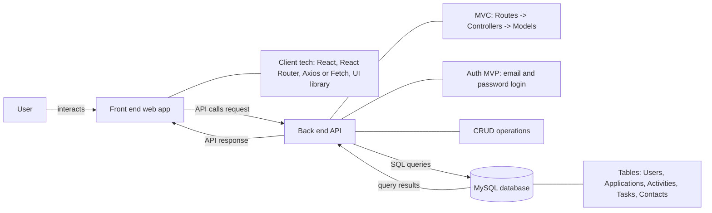
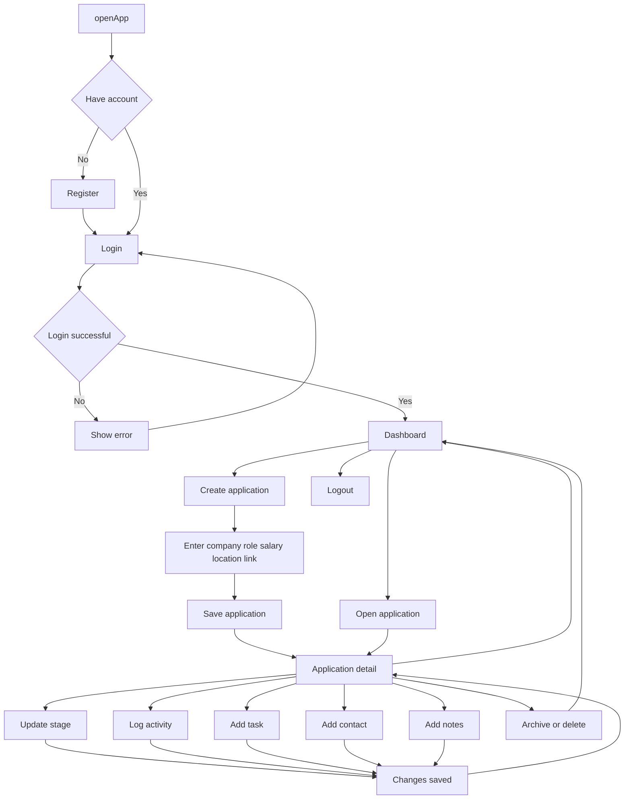

# Capstone Project Document Template

> [!NOTE]
> The following are the candidate sections of the document. They are presented here for guidance. Questions in each section could be used as possible aspects to cover. Some questions may not be applied to each project. On the other hand, additional information may be needed.

## Introduction

### Purpose

**What is the problem or the opportunity that the project is investigating?**

Job searching lacks a centralized place to organize everything like job listings, application statuses, interview notes, followups, emails. This project provides a system to organize the information and also provide visibility through the job application lifecycle.

**Why is this problem valuable to address?**

A disorganized job search can lead to missed follow-ups, duplicated applications, mistracked interview stages, and reduced hiring/offer rates. In this job market, better organization can streamline the process and directly impact employment outcomes.

**What is the current state (e.g. unsatisfied users, lost revenue)?**

Many users like myself rely on manually tracking through tools like spreadsheets, notes apps, or sheer memory to track applications. While platforms like LinkedIn and Indeed provide job listings they lack hiring pipeline tools beyond just what was saved or applied.

**What is the desired state?**

A centralized dashboard where users can:
- manage applications(company, role, salary range, location, link),
- track progress through defined stages (Saved, Applied, Interviewing, Offer, Rejected),
- log interview activities(calls, emails, interviews),
- store contacts per company (recruiter, hiring manager),
- add tasks/reminders (follow up next Monday)
- store attachments/notes/links

**Has this problem been addressed by other projects? What were the outcomes?**

From what I have researched, platforms like Hunter and other tools have similar pipeline style tracking systems but are subscription-based, have limited customization, or just dont integrate enough relational data modeling, resulting in going off app…users eventually just result to using excel or combination of other manual ways to note/track jobs.

### Industry/ Domain

**What is the industry/ domain?**

he project falls within the Job Search Technology and Career Management Software domain, which is part of the broader HR Technology (HRTech) industry.

**What is the current state of this industry? (e.g. challenges from startups)**

The industry is highly competitive and dominated by large platforms such as LinkedIn and Indeed--if you were to narrow the scope to job discovery. Startups in this space aim to provide more user-centered tools that improve organization, automation, and analytics during the job search process.

**What is the overall industry value-chain?**

The value chain typically includes:
- Employers creating job listings
- Platforms distributing job postings
- Candidates discovering and applying to jobs
- Recruiters reviewing and interviewing candidates
- Hiring decisions and onboarding

This project operates within the candidate management stage of the value chain, focusing on applicant-side organization rather than employer-side recruitment systems.

**What are the key concepts in the industry?**
- Applicant tracking
- Hiring pipeline stages
- Workflow management
- User authentication and security
- Data organization and analytics
- Productivity and career management

**Is the project relevant to other industries?**

Yes. The core architecture of this system could be adapted to other pipeline-based workflows such as sales tracking/CRM systems, project management tools, freelance client tracking, or college admissions tracking systems. The underlying design pattern is applicable to any structured multi-stage process.

### Stakeholders

**Who are the stakeholders? (be as specific as possible as to who would have access to the software)**

Primary Users: Job seekers managing their application pipeline
Secondary Users (future scope): Career coaches or mentors who may assist applicants
Developers/Maintainers: Individuals responsible for maintaining and scaling the system

**Why do they care about this software?**

Primary stakeholders (job seekers) care because the job search process is often stressful, fragmented, and difficult to manage. This software provides structure, visibility, and control over their application pipeline, helping them avoid missed follow-ups, duplicate applications, and lost opportunities. By centralizing job data in one system, users can make more informed decisions and track measurable progress toward employment.

Secondary stakeholders, such as career coaches or mentors, care because the system provides transparent insight into a candidate’s progress. It allows them to identify bottlenecks in the hiring process and offer targeted guidance.

From a technical perspective, developers and maintainers care because the system demonstrates scalable architecture, secure authentication, structured data modeling, and maintainable code practices. These qualities ensure the software is reliable, extensible, and adaptable to future enhancements.

**What are the stakeholders’ expectations?**
- Secure authentication and data privacy
- Reliable CRUD functionality
- Clear dashboard visualization of application stages
- Accurate data persistence
- Responsive and intuitive UI
- Stable performance and test coverage

## Product Description

### Architecture Diagram

JobTrail is a client–server web application. Users interact with a React-based front-end which communicates with an Express/Node back-end via REST API calls. The back-end follows an MVC structure (Routes → Controllers → Models) and performs CRUD operations against a MySQL database. Authentication is implemented at an MVP level using email/password login and storing the logged-in user context on the client to scope data to that user.

#### Client (Front-End)

- **React** – UI rendering and component-based pages (Login, Dashboard, Forms)
- **React Router** – navigation between pages (protected pages for logged-in users)
- **Axios / Fetch** – API client for sending requests to the server
- **UI Library (optional: MUI / Chakra / etc.)** – form components and layout styling

#### Server (Back-End)

- **Node.js** – JavaScript runtime for the server
- **Express.js** – REST API framework and routing
- **MVC Structure**
  - **Routes** – map API endpoints (e.g., `/api/applications`)
  - **Controllers** – handle request logic, validation, and business rules
  - **Models** – interact with the database (SQL queries / ORM)
- **Authentication (MVP)**
  - `POST /api/auth/register` – creates a user
  - `POST /api/auth/login` – verifies email and password, returns user information (e.g., `userId`)
  - Subsequent requests include `userId` to scope data to the logged-in user

#### Database

- **MySQL** – relational storage for:
  - Users
  - Applications
  - Activities (interviews / notes)
  - Tasks (follow-ups)
  - Contacts

---

### User Stories

#### 1. Account Registration

**Priority:** High

**Description:**
User is able to create an account using email and password.

**User Story:**
As a user, I want to create an account with my email and password
so that I can securely access and manage my job applications.

**Acceptance Criteria:**
- Given a user submits valid registration details, then a new account is created and stored in the database.
- Given a user submits an email that already exists, then the system displays an appropriate error message.

---

#### 2. Login Functionality

**Priority:** High

**Description:**
User is able to log in securely.

**User Story:**
As a user, I want to log in using my credentials
so that I can access my saved job applications and data.

**Acceptance Criteria:**
- Given a user enters valid login credentials, then they are authenticated and redirected to the dashboard.
- Given invalid credentials are entered, then the system displays an error message.

---

#### 3. Create Job Application

**Priority:** High

**Description:**
User can create a new job application entry.

**User Story:**
As a user, I want to add a job application including company, role, salary range, location, and job link
so that I can track all relevant details in one place.

**Acceptance Criteria:**
- Given a user submits a completed job application form, then the application is saved in the database.
- Given required fields are missing, then the system prevents submission and displays validation errors.

---

#### 4. Track Application Progress

**Priority:** High

**Description:**
User can update the hiring stage of an application.

**User Story:**
As a user, I want to update an application's status
so that I can clearly see where I stand in the hiring process.

**Acceptance Criteria:**
- Given a user selects a new hiring stage, then the updated stage is saved to the database.
- Given the dashboard loads, then each application displays its current stage.

---

#### 5. Interview Activity Logging

**Priority:** High

**Description:**
User can log interview-related activities.

**User Story:**
As a user, I want to record interview dates and notes
so that I can track communication history and prepare for next steps.

**Acceptance Criteria:**
- Given a user submits interview details, then the activity is saved and linked to the correct application.
- Given an application is viewed, then all associated interview activities are displayed.

---

#### 6. Manage Contacts

**Priority:** Medium

**Description:**
User can store recruiter or company contact information.

**User Story:**
As a user, I want to save contact details for recruiters or hiring managers
so that I can easily reference them for follow-ups.

**Acceptance Criteria:**
- Given a user submits contact information, then the contact is saved in the database.
- Given a user views an application, then associated contact details are displayed.

---

#### 7. Follow-Up Task Management

**Priority:** High

**Description:**
User can create and manage follow-up tasks.

**User Story:**
As a user, I want to create reminders for follow-ups or deadlines
so that I do not miss important actions in the hiring process.

**Acceptance Criteria:**
- Given a user creates a task with a due date, then the task is saved and linked to the appropriate application.
- Given a user marks a task as complete, then the task status updates accordingly.

---

#### 8. Dashboard Summary

**Priority:** Medium

**Description:**
User can view an overview of application statistics.

**User Story:**
As a user, I want to see a summary of my applications
so that I can quickly understand my overall progress.

**Acceptance Criteria:**
- Given a user logs in, then the dashboard displays total application count.
- Given applications exist in different stages, then the dashboard shows a breakdown by stage.

---

#### 9. Application Search & Filtering

**Priority:** Medium

**Description:**
User can filter applications by stage or company.

**User Story:**
As a user, I want to filter or search my applications
so that I can quickly find specific entries.

**Acceptance Criteria:**
- Given a user enters search criteria, then only matching applications are displayed.
- Given a user selects a stage filter, then only applications in that stage are shown.

---

#### 10. Archive/Delete Application

**Priority:** Medium

**Description:**
User can remove or archive applications.

**User Story:**
As a user, I want to delete or archive old applications
so that my dashboard stays organized.

**Acceptance Criteria:**
- Given a user selects delete, then the application is removed from the database.
- Given a user selects archive, then the application is marked inactive and removed from the active dashboard view.

---

### User Flow

### Wireframe Design

- Show elements of the user interface, either manually or via a tool such as Figma.

## Open Questions / Out of Scope

- Third-party job board integrations (LinkedIn, Indeed, etc.) and automatic application importing.
- Social login (Google, GitHub) and enterprise authentication.
- Advanced security features (JWT refresh tokens, 2FA, full encryption at rest).
- File uploads (resume PDFs, screenshots) stored in the app database (attachments will be stored as links or notes in MVP).
- Real-time notifications (email/SMS/push notifications).
- Multi-user collaboration (sharing applications with others).
- Analytics dashboards beyond simple counts (charts, trends, predictions).

- Should “attachments” be implemented as **links only** (MVP) or actual file uploads (stretch)?
- Should “archive” be a soft-delete (status flag) or a permanent delete?
- What is the final list of hiring stages (MVP uses: Saved, Applied, Interviewing, Offer, Rejected)?

#### Non-functional Requirements

- What are the key security requirements? (e.g. login, storage of personal details, inactivity timeout, data encryption)
    - Users must log in to access their dashboard and saved records.
    - User data should be scoped so users can only view and edit their own applications.
    - Password input should not be displayed in plain text on the UI.
    - Sensitive configuration values (database credentials) must be stored in environment variables (e.g., `.env`) and not committed to GitHub.
    - Basic input validation should be enforced to reduce invalid or unsafe submissions.

- How many transactions should be enabled at peak time?
    - Expected peak load is small (capstone scale): approximately 1–10 concurrent users.
    - The system should support typical CRUD activity during peak time (e.g., creating and updating applications/tasks) without noticeable lag.
    - Target: handle multiple requests per minute without errors during demo usage.

- How easy to use does the software need to be?
    - The application should be easy to learn with minimal instruction.
    - Navigation should be consistent across pages (same layout and controls).
    - Forms should provide clear validation messages for missing or invalid fields.
    - The dashboard should make it easy to see application status at a glance.

- How quickly should the application respond to user requests?
    - The app should respond to most user actions within 1–2 seconds in normal conditions.
    - Dashboard and list views should load quickly with pagination or filtering if needed.
- How reliable must the application be? (e.g. mean time between failures)
    - The system should be stable for usage during demo and testing.
    - Errors should be handled with helpful messages (no crashing UI).
    - Target: basic availability during demo usage; logging should help diagnose failures.
- Does the software conform to any technical standards to ease maintainability?
    - Backend follows MVC structure (Routes → Controllers → Models) for consistency and readability.
    - RESTful endpoint naming conventions.
    - Consistent code style and naming conventions (camelCase in JS, clear route naming).
    - README includes setup steps and environment variable instructions.

## Project Planning

- Include GitHub project board showing key milestones (with dates) to complete the project.

### Testing Strategy

- What were steps undertaken to achieve product quality?
- How was each feature of the application tested?
- How did you handle edge cases?

### Implementation

#### Deployment Strategy

The application is deployed using Docker to ensure consistent environments between local development and production. Containerization allows the backend and database services to run in isolated, reproducible environments.

Docker was selected because it:

- Ensures the same environment runs locally and in production
- Simplifies setup for marking and demo (single command to run services)
- Reduces “works on my machine” issues
- Makes configuration explicit via Dockerfiles and environment variables
- Supports scalable deployment to container-based hosting platforms

#### Deployment Components

- **Frontend:** React application built for production and served to users.
- **Backend:** Express API packaged as a Docker container.
- **Database:** MySQL database used for persistent storage of Users, Applications, Activities, Tasks, and Contacts.

Depending on deployment configuration, the database may be:
- Hosted as a managed cloud database service, or
- Containerized as part of the Docker Compose setup.

#### Environment Variables

Sensitive configuration values are stored in environment variables and are not committed to GitHub.

Examples include:

- `DB_HOST`
- `DB_PORT`
- `DB_NAME`
- `DB_USER`
- `DB_PASSWORD`
- `PORT`
- `CLIENT_URL`

This ensures credentials and configuration details remain secure and can be adjusted per environment (development vs production).

#### High-Level Deployment Process

1. Build Docker images for the backend (and optionally frontend).
2. Push Docker images to a container registry (e.g., Docker Hub).
3. Deploy the backend container to a Docker-compatible hosting platform.
4. Configure required environment variables in the hosting platform.
5. Connect the deployed backend to the production MySQL database.
6. Run initial table creation or migration scripts if required.
7. Verify end-to-end functionality:
   - User login
   - Create application
   - Update application stage
   - Add tasks and activities
   - Dashboard data retrieval

#### Risks

- **Database connectivity issues:**
  Validated environment variables and tested database connection before deployment.

- **Environment mismatch between development and production:**
  Resolved by using Docker containers to standardize runtime configuration.

- **CORS errors between frontend and backend:**
  Explicitly configured allowed origins in the Express server.

- **Sensitive credentials exposure:**
  All secrets stored in environment variables and excluded from version control.

### End-to-end Solution

- How well did the software meet its objectives?

### References

- Where is the code used in the project? (Use permalinks to GitHub)
- What are the resources used in the project? (libraries, APIs, databases, tools, etc)
    - **Frontend:** React, React Router, Axios/Fetch, (optional) UI library
    - **Backend:** Node.js, Express.js
    - **Database:** MySQL
    - **Dev Tools:** Git/GitHub, VS Code, Postman or Hoppscotch, Mermaid Viewer
    - **Testing:** Jest (and/or Supertest for API tests, if used)
    - **Documentation:** Markdown (README), Mermaid diagrams
